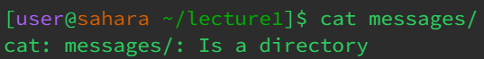

# Lab Report 1

## `cd` with no arguments

The working directory was `/home` when the code was run. `cd` does not have any output and it worked as expected. As there was no argument, the directory we were in did not change as we can see in the next line. The output is not an error but this line was pointless as it did nothing.

## `cd` with directory as argument

The working directory was `/home` when the code was run. `cd` does not have any output and it worked as expected. We changed our working directory to `/home/lecture1` and we can see this in the next line. The output is not an error since we switched directories like we wanted.

## `cd` with file as argument

The working directory was `/home/lecture1` when the code was run. `cd` gave an error output as the code did not work as expected. We could not change our directory to `Hello.java` because it is a file and not a folder/directory.

## `ls` with no argument

The working directory was `/home/lecture1` when the code was run. `ls` gave an output of all the files and folders that are inside the `lecture1` folder. Having no arguments meant that we wanted to know all the files and folders in the current directory. There were no errors.

## `ls` with directory as argument

The working directory was `/home/lecture1` when the code was run. `ls` gave an output of all the files that were inside the `messages` folder. As we passed in the `messages` path as an arugment, `ls` showed all the files inside of it. There were no errors.

## `ls` with file as argument

The working directory was `/home/lecture1` when the code was run.`ls` returned the name of the file we passed in as an argument, which was `Hello.java`. There were no errors but this was pointless as we did not find out what was inside the file. 

## `cat` with no argument

The working directory was `/home/lecture1` when the code was run. `cat` did not print any output unless something else was typed into the terminal. It would then output exactly what you would type into it. This is an error because `cat` is supposed to print out the contents inside a file but without any file passed to it, it could only repeat whatever output you pass in.

## `cat` with directory as argument

The working directory was `/home/lecture1` when the code was run. `cat` gave an error as an output stating that `messages` was a directory. `cat` could not print the contents since `messages` is not a file. 

## `cat` with file as argument

The working directory was `/home/lecture1/messages` when the code was run. `cat` printed "Hello World!" as that was the contents of the file that we passed into it. 
