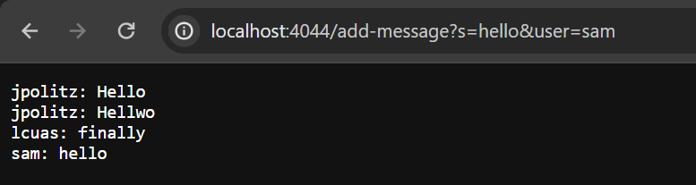

# Lab Report 2

## ChatServer code
```
import java.io.IOException;
import java.net.URI;

class ChatHandler implements URLHandler {
    // The one bit of state on the server: a number that will be manipulated by
    // various requests.
    String allChats = "";

    public String handleRequest(URI url) {
        if (url.getPath().equals("/")) {
            return allChats;
        } else {
            if (url.getPath().contains("/add-message")) {
                String[] parameters = url.getQuery().split("&");
                if(parameters[1].contains("user=")){
                    String userPart[] = parameters[1].split("=");
                    String user = userPart[1];
                    if (parameters[0].contains("s=")) {
                        String messagePart[] = parameters[0].split("=");
                        String message = messagePart[1];
                        allChats += user + ": " + message +"\n";
                        return allChats;
                    }
                }
            }
            return "404 Not Found!";
        }
    }
}

class ChatServer {
    public static void main(String[] args) throws IOException {
        if(args.length == 0){
            System.out.println("Missing port number! Try any number between 1024 to 49151");
            return;
        }

        int port = Integer.parseInt(args[0]);

        Server.start(port, new ChatHandler());
    }
}
```

## Example 1


At this point, the value of `allChats` already has the 2 messages displayed above which are "jpolitz: Hello \n jpolitz: Hellwo \n". Firstly, the `handleRequest` method is called with the URL passed in as an argument. The value of `url` changes to be `http://localhost:4044/add-messsage?s=finally&user=lcuas`. Within the method, the value of `user` changes to "lcuas", and the value of `message` changes to "finally". Finally, the value of `allChats` changes to be "jpolitz: Hello \n jpolitz: Hellwo \n lcuas: finally \n". 


## Example 2



At this point, the value of `allChats` already has the 3 messages displayed above which are "jpolitz: Hello \n jpolitz: Hellwo \n lcuas: finally \n". 
 Firstly, the `handleRequest` method is called with the URL passed in as an argument. The value of `url` changes to be `http://localhost:4044/add-messsage?s=hello&user=sam`. Within the method, the value of `user` changes to "sam", and the value of `message` changes to "hello". Finally, the value of `allChats` changes to be "jpolitz: Hello \n jpolitz: Hellwo \n lcuas: finally \n sam: hello \n". 


## Private Key


The absolute path would be `/c/Users/minzi/.ssh/id_ed25519.pub`. 


## Public Key


The absolute path would be `/home/linux/ieng6/oce/8o/mhlaing/.ssh/authorized_keys`.


## Login Without Password


## Things learned


I've learned a lot about the terminal and am more comfortable navigating around it now. I didn't know we could create keys to access online accounts within our terminal, and it feels very useful. I also know the basics of how a server works such as returning values to be shown on the server. I now know that queries in the html are used within the code to be able to perform certain functions. 
