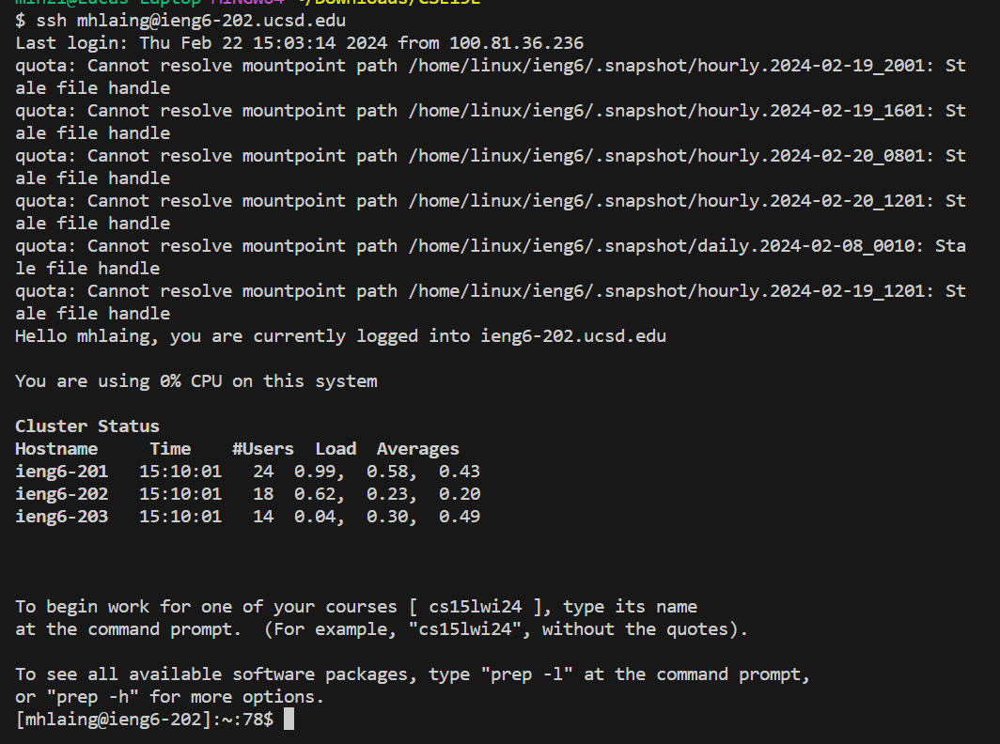
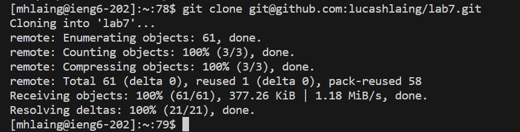
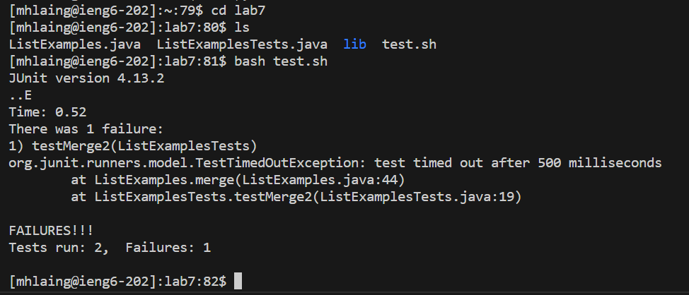
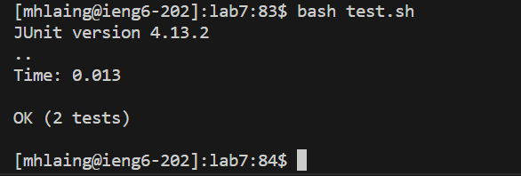
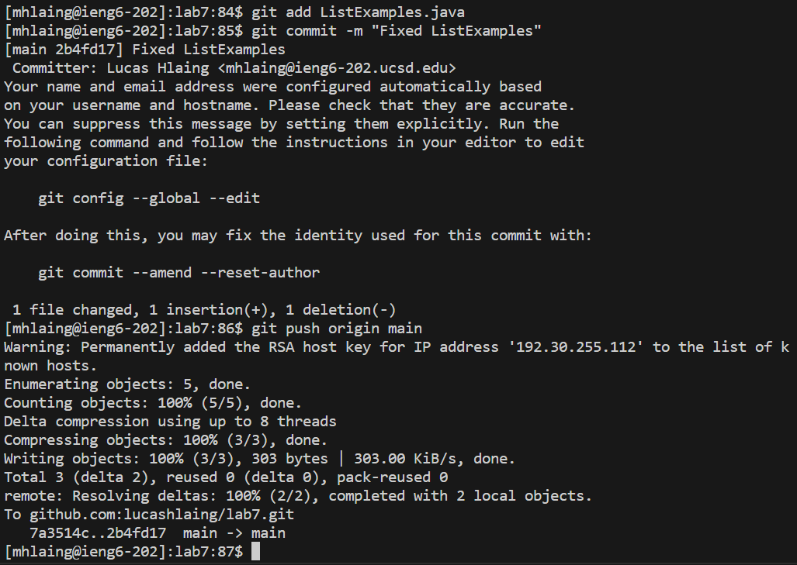

# Lab Report 4

## Step 4

I typed in `ssh mhlaing@ieng6.ucsd.edu` and pressed `<Enter>` to log into the ieng6 computer. Since I have already created authorized keys, it instantly logged me in

## Step 5

I typed in `git clone git@github.com:lucashlaing/lab7.git` and pressed `<Enter>`. I cloned the fork I had on my GitHub with this command.

## Step 6

Firstly, I typed in `cd lab7 <Enter>` to move my working directory into lab7. Then I typed in `ls <Enter>` to check all the files in the directory. Lastly, I typed in `bash test.sh <Enter>`. This ran the bash script named test with all the tests. We can see that 1 of them fails. 

## Step 7

Firstly, I typed in `vim ListExamples.java <Enter>` to open up that java file in vim. Then I typed in `:$ <Enter>` to go to the bottom of the file. Next, I typed in `6k w e`. `6k` moved the cursor to the line with the error. `w` moved me the first word and `e` moved me to the end of said word where the error was. Next, I typed in `x` to delete the 1. I then typed in `i` to enter Insert Mode and typed "2". I type `<Esc>` to go back to Normal mode from Insert Mode. Lastly, I typed `:wq <Enter>` to save the code and exit vim.

## Step 8

I press `<up><up><Enter>` since the `bash test.sh` command was 2 commands up and I used the arrows to access it and run it. We can see that all the tests pass.

## Step 9

Firstly, I typed in `git add ListE<Tab><Enter>`. I used `<Tab>` to autofill the name of the file. This added ListExamples.java into the files which would be included in the commit. Next, I typed in `git commit -m "Fixed ListExamples" <Enter>` This created a commit of my code with the message "Fixed ListExamples." Lastly, I type in `git push origin main <Enter>` to push the commit to the main repository on my Github. 
